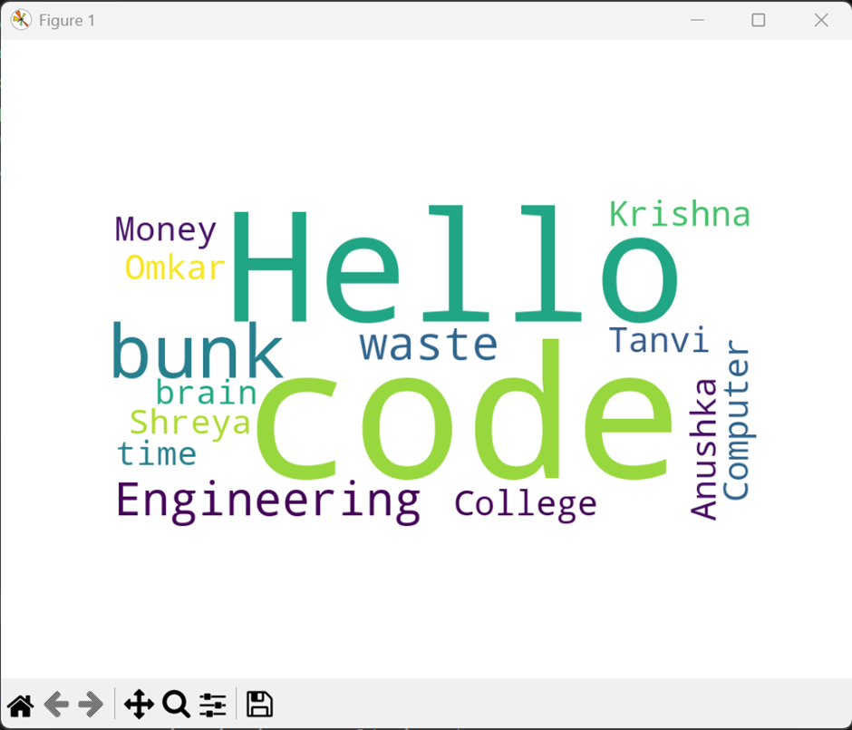

#file:cpp

# ADSA Experiments

---

## ASSIGNMENT NO. 1

**Problem Statement:**
Write C++ code for merge sort and analyze time complexity.

**Aim:**
To understand and implement the Merge Sort algorithm.

**Objective:**
1. To implement the Merge Sort algorithm using the divide and conquer strategy.
2. To analyze its performance in terms of time and space complexity.

**Theory / Background:**
**What is Sorting?**
Sorting is the process of arranging data elements in a specific order. 

**Merge Sort Overview:**
Merge Sort is a divide and conquer algorithm that splits the input array into smaller subarrays until each contains a single element. It then recursively sorts the subarrays and merges them to produce the final sorted array.

**Algorithm Steps:**
1. Start
2. Find the middle index of the array to divide it into two halves.
3. Recursively apply Merge Sort to both halves until single-element subarrays are achieved.
4. Compare and merge elements of the sorted subarrays to form a single sorted array.
5. End

**Code:**
```cpp
#include <iostream>
#include <vector>

using namespace std;

void merge(vector<int>& arr, int left, int mid, int right) {
    int n1 = mid - left + 1;
    int n2 = right - mid;

    vector<int> L(n1);
    vector<int> R(n2);

    for (int i = 0; i < n1; i++) L[i] = arr[left + i];
    for (int j = 0; j < n2; j++) R[j] = arr[mid + 1 + j];

    int i = 0, j = 0, k = left;
    while (i < n1 && j < n2) {
        if (L[i] <= R[j]) {
            arr[k] = L[i];
            i++;
        } else {
            arr[k] = R[j];
            j++;
        }
        k++;
    }

    while (i < n1) { arr[k] = L[i]; i++; k++; }
    while (j < n2) { arr[k] = R[j]; j++; k++; }
}

void mergeSort(vector<int>& arr, int left, int right) {
    if (left >= right) return;
    int mid = left + (right - left) / 2;
    mergeSort(arr, left, mid);
    mergeSort(arr, mid + 1, right);
    merge(arr, left, mid, right);
}

void printArray(const vector<int>& arr) {
    for (int x : arr) cout << x << " ";
    cout << endl;
}

int main() {
    vector<int> arr = {12, 11, 13, 5, 6, 7};
    cout << "Original array: ";
    printArray(arr);
    mergeSort(arr, 0, arr.size() - 1);
    cout << "Sorted array:   ";
    printArray(arr);
    return 0;
}
```

**Analysis:**
- **Time Complexity:**
  - *Best Case:* O(n log n)
  - *Average Case:* O(n log n)
  - *Worst Case:* O(n log n)
- **Space Complexity:** O(n)
- **Stability:** Yes (Stable sort)

**Conclusion:**
Merge Sort is a stable and efficient sorting algorithm with a consistent time complexity of `O(n log n)`.

---

## ASSIGNMENT NO. 2

**Problem Statement:**
Implement 0/1 Knapsack problem.

**Aim:**
To understand and implement the 0/1 Knapsack problem using Dynamic Programming.

**Objective:**
1. To learn how to solve optimization problems using Dynamic Programming.
2. To maximize the total profit without exceeding the weight capacity of the knapsack.

**Theory / Background:**
The 0/1 Knapsack problem is a combinatorial optimization problem. Given a set of items, each with a weight and a value, we must determine which items to include in a collection so that the total weight is less than or equal to a given limit (capacity) and the total value is as large as possible. In "0/1", you can either take an item entirely (1) or leave it (0).

**Algorithm Steps:**
1. Initialize a 2D array `dp` of size `(n+1) x (W+1)` with zeros, where `n` is the number of items and `W` is the capacity.
2. Loop through each item, and for each item, loop through all possible capacities from 1 to `W`.
3. If the item's weight is less than or equal to the current capacity, choose the maximum between including the item and not including it.
4. Otherwise, if the weight is strictly greater than the capacity, copy the value from the upper row.
5. `dp[n][W]` will hold the maximum possible value.

**Code:**
```cpp
#include <iostream>
#include <vector>
#include <algorithm>

using namespace std;

int knapSack(int W, const vector<int>& wt, const vector<int>& val, int n) {
    vector<vector<int>> dp(n + 1, vector<int>(W + 1, 0));

    for (int i = 0; i <= n; i++) {
        for (int w = 0; w <= W; w++) {
            if (i == 0 || w == 0) {
                dp[i][w] = 0;
            } else if (wt[i - 1] <= w) {
                dp[i][w] = max(val[i - 1] + dp[i - 1][w - wt[i - 1]], dp[i - 1][w]);
            } else {
                dp[i][w] = dp[i - 1][w];
            }
        }
    }
    return dp[n][W];
}

int main() {
    vector<int> val = {60, 100, 120};
    vector<int> wt = {10, 20, 30};
    int W = 50; 
    int n = val.size();

    cout << "Maximum value that can be put in a knapsack of capacity " << W << " is " << knapSack(W, wt, val, n) << endl;
    return 0;
}
```

**Analysis:**
- **Time Complexity:** O(n * W)
- **Space Complexity:** O(n * W)

**Conclusion:**
We successfully implemented the 0/1 Knapsack Problem using Dynamic Programming to find the optimal maximum value within a bounded weight capacity.

---

## ASSIGNMENT NO. 3

**Problem Statement:**
Implement Cuckoo Hashing.

**Aim:**
To understand and implement Cuckoo Hashing to resolve collisions.

**Objective:**
1. To understand the mechanism of hashing with multiple hash functions.
2. To resolve collisions aggressively by displacing previous keys.

**Theory / Background:**
Cuckoo hashing is a scheme for resolving hash collisions using two hash functions and two hash tables. When inserting a new key, if the primary slot in the first table is occupied, the old key is pushed out (like a cuckoo bird pushes eggs out of a nest) and moved to its alternative slot in the second table. This displacement repeats until a vacant spot is found or a cycle is detected.

**Algorithm Steps:**
1. Use two hash functions `hash1` and `hash2` and two arrays `table1` and `table2`.
2. To insert a key, compute its position using `hash1`.
3. If the position is empty, place the key.
4. If occupied, push the old key out, insert the new one, and then try to insert the pushed-out key into `table2` using `hash2`.
5. Repeat this bouncing process until everything settles or a maximum number of bounces is reached (rehashing would be required in this case).

**Code:**
```cpp
#include <iostream>
#include <vector>
#include <string>

using namespace std;

class CuckooHash {
private:
    int size;
    vector<int> table1;
    vector<int> table2;

    int hash1(int key) { return key % size; }
    int hash2(int key) { return (key / size) % size; }

public:
    CuckooHash(int tableSize) : size(tableSize) {
        table1.assign(size, -1);
        table2.assign(size, -1);
    }

    void insert(int key) {
        int targetKey = key;
        for (int i = 0; i < size; ++i) {
            int pos1 = hash1(targetKey);
            if (table1[pos1] == -1) {
                table1[pos1] = targetKey;
                return;
            }
            // Swap and push out
            swap(targetKey, table1[pos1]);

            int pos2 = hash2(targetKey);
            if (table2[pos2] == -1) {
                table2[pos2] = targetKey;
                return;
            }
            // Swap and push out
            swap(targetKey, table2[pos2]);
        }
        cout << "Cycle detected for key " << key << "! Need rehashing." << endl;
    }

    void display() {
        cout << "Table 1: ";
        for (int x : table1) cout << (x == -1 ? "-" : to_string(x)) << " ";
        cout << "\nTable 2: ";
        for (int x : table2) cout << (x == -1 ? "-" : to_string(x)) << " ";
        cout << endl;
    }
};

int main() {
    CuckooHash ch(5); // Table sizes of 5
    int keys[] = {20, 50, 53, 75, 100};
    
    for (int key : keys) {
        ch.insert(key);
    }
    
    ch.display();
    return 0;
}
```

**Analysis:**
- **Time Complexity:** 
  - *Best Case:* O(1) for insertion and lookup.
  - *Worst Case:* O(n) for insertion if rehashing happens. 
- **Space Complexity:** O(n)

**Conclusion:**
Cuckoo hashing provides guaranteed O(1) time lookups and deletions by relocating entries upon collision.

---

## ASSIGNMENT NO. 4

**Problem Statement:**
Implement any real time application with the help of hashing concept and handle collision using linear probing without replacement.

**Aim:**
To implement a real-time Hash Table application handling collisions via Linear Probing without Replacement.

**Objective:**
1. To understand collision handling using Linear Probing.
2. To create a practical hashing application, such as a localized Student Database mapping Roll Number to Names.

**Theory / Background:**
Hashing is used to retrieve data in O(1) average time. Linear Probing is an open-addressing strategy where if a collision occurs at index `i`, we linearly probe `i+1`, `i+2`, ... to find the next available empty spot. 'Without replacement' means we never move an element once it is placed in the table.

**Algorithm Steps:**
1. Define a Hash Table size.
2. For an input key, calculate index = `key % size`.
3. If `table[index]` is unoccupied, place the key.
4. If occupied, incrementally check `(index + i) % size` until an empty slot is found.
5. Insert the element in that available spot.

**Code:**
```cpp
#include <iostream>
#include <vector>
#include <string>

using namespace std;

class StudentRecord {
public:
    int roll;
    string name;
    StudentRecord() : roll(-1), name("") {}
    StudentRecord(int r, string n) : roll(r), name(n) {}
};

class HashTable {
private:
    int size;
    vector<StudentRecord> table;

public:
    HashTable(int s) : size(s) {
        table.assign(size, StudentRecord());
    }

    int hashFunc(int key) {
        return key % size;
    }

    void insert(int roll, string name) {
        int index = hashFunc(roll);
        int i = 0;
        
        while (table[(index + i) % size].roll != -1) {
            if (table[(index + i) % size].roll == roll) {
                cout << "Roll number already exists." << endl;
                return;
            }
            i++;
            if (i == size) {
                cout << "Hash Table is Full!" << endl;
                return;
            }
        }
        
        table[(index + i) % size] = StudentRecord(roll, name);
        cout << "Inserted " << name << " at index " << (index + i) % size << endl;
    }

    void display() {
        for (int i = 0; i < size; i++) {
            if (table[i].roll != -1)
                cout << "Index " << i << ": Roll = " << table[i].roll << ", Name = " << table[i].name << endl;
            else
                cout << "Index " << i << ": Empty" << endl;
        }
    }
};

int main() {
    HashTable ht(5);
    ht.insert(10, "Arnav");
    ht.insert(15, "Bob");     // Collision with 10 if size is 5
    ht.insert(20, "Alice");   // Collision again
    ht.display();
    return 0;
}
```

**Analysis:**
- **Time Complexity:**
  - *Best Case:* O(1) 
  - *Average/Worst Case:* O(n) (when clustering occurs).
- **Space Complexity:** O(n)

**Conclusion:**
Linear probing successfully resolves collisions, but may lead to primary clustering when the load factor gets high.

---

## ASSIGNMENT NO. 5

**Problem Statement:**
A Dictionary stores keywords & its meanings. Provide facility for adding new keywords, deleting keywords, updating values of any entry. Provide facility to display whole data sorted in ascending/ Descending order. Also find how many maximum comparisons may require for finding any keyword. Use Binary Search Tree for implementation.

**Aim:**
To implement a dynamic Dictionary using a Binary Search Tree (BST).

**Objective:**
1. To use a BST to store Key-Value pairs efficiently.
2. To allow fast insertion, retrieval, and ordered traversal (Ascending / Descending).

**Theory / Background:**
A Binary Search Tree uniquely maintains an ordering property: the left subtree contains smaller keys, and the right subtree contains larger keys. Therefore, an Inorder traversal results in sorting in Ascending Order, while a reverse Inorder traversal results in Descending Order. The maximum comparisons required for a lookup is mathematically equivalent to the height of the BST.

**Algorithm Steps:**
1. Create a recursive Node structure holding a Keyword, Meaning, Left Child, and Right Child.
2. **Insertion:** Navigate left if smaller, right if larger, until finding a null spot to insert. 
3. **Ascending:** Process Left -> Node -> Right.
4. **Descending:** Process Right -> Node -> Left.
5. **Max Comparisons:** Track the depth/height of the tree recursively.

**Code:**
```cpp
#include <iostream>
#include <string>
#include <algorithm>

using namespace std;

struct Node {
    string keyword, meaning;
    Node *left, *right;
    Node(string k, string m) : keyword(k), meaning(m), left(nullptr), right(nullptr) {}
};

class Dictionary {
    Node* root;

    Node* insertRec(Node* root, string k, string m) {
        if (!root) return new Node(k, m);
        if (k < root->keyword) root->left = insertRec(root->left, k, m);
        else if (k > root->keyword) root->right = insertRec(root->right, k, m);
        else root->meaning = m; // Update existing
        return root;
    }

    void inorderAsc(Node* root) {
        if (root) {
            inorderAsc(root->left);
            cout << root->keyword << " : " << root->meaning << endl;
            inorderAsc(root->right);
        }
    }

    void inorderDesc(Node* root) {
        if (root) {
            inorderDesc(root->right);
            cout << root->keyword << " : " << root->meaning << endl;
            inorderDesc(root->left);
        }
    }

    int getHeight(Node* root) {
        if (!root) return 0;
        return 1 + max(getHeight(root->left), getHeight(root->right));
    }

public:
    Dictionary() : root(nullptr) {}
    void add(string k, string m) { root = insertRec(root, k, m); }
    void displayAscending() { cout << "Ascending:\n"; inorderAsc(root); }
    void displayDescending() { cout << "Descending:\n"; inorderDesc(root); }
    int maxComparisons() { return getHeight(root); }
};

int main() {
    Dictionary dict;
    dict.add("Apple", "A fruit");
    dict.add("Zebra", "An animal");
    dict.add("Mango", "King of fruits");
    dict.add("Apple", "A red fruit"); // Update test

    dict.displayAscending();
    cout << "\n";
    dict.displayDescending();
    
    cout << "\nMax comparisons needed for any keyword: " << dict.maxComparisons() << endl;
    return 0;
}
```

**Analysis:**
- **Time Complexity:** 
  - *Average Case (Insertion/Search):* O(log n)
  - *Worst Case (Skewed Tree):* O(n)
- **Space Complexity:** O(n) for the tree nodes plus O(h) for recursion depth.

**Conclusion:**
Using a BST provides a scalable and automatically ordered structure that effectively acts as a dynamic dictionary.

---

## ASSIGNMENT NO. 6

**Problem Statement:**
Construct inorder TBT (Threaded Binary Tree) and apply nonrecursive traversals.

**Aim:**
To construct an Inorder Threaded Binary Tree and traverse it without using recursion or a stack.

**Objective:**
1. To understand exactly how Threaded Binary Trees optimize space and traversal time.
2. To link the null right pointers to their inorder successors.

**Theory / Background:**
Standard BST traversals demand a stack or recursion to remember unvisited ancestors. A Threaded Binary Tree (TBT) repurposes empty `right` pointers to point directly to the node's Inorder Successor, allowing for purely iterative O(1) space traversal. A boolean flag specifies whether the right pointer is a normal child or a 'thread'.

**Algorithm Steps:**
1. Node structure must hold a `isThreaded` boolean flag.
2. Determine where to insert the new Node (Standard BST logic).
3. **Update pointers:** If inserted as a left child, its thread becomes the parent. If inserted as a right child, its thread inherits the parent's thread.
4. **Traversal:** Start at the leftmost node. If it has a thread, jump right using the thread. If it has a right child, jump right and then go leftmost again.

**Code:**
```cpp
#include <iostream>

using namespace std;

struct Node {
    int data;
    Node* left;
    Node* right;
    bool isThreaded;

    Node(int val) : data(val), left(nullptr), right(nullptr), isThreaded(false) {}
};

class ThreadedBST {
private:
    Node* root;

    Node* leftmost(Node* node) {
        if (!node) return nullptr;
        while (node->left) node = node->left;
        return node;
    }

public:
    ThreadedBST() : root(nullptr) {}

    void insert(int key) {
        Node* newNode = new Node(key);
        if (!root) {
            root = newNode;
            return;
        }

        Node* curr = root;
        Node* parent = nullptr;
        while (curr) {
            parent = curr;
            if (key < curr->data) {
                curr = curr->left;
            } else if (!curr->isThreaded) {
                curr = curr->right;
            } else {
                break;
            }
        }

        if (key < parent->data) {
            parent->left = newNode;
            newNode->right = parent;
            newNode->isThreaded = true;
        } else {
            newNode->right = parent->right;
            newNode->isThreaded = parent->isThreaded;
            parent->isThreaded = false;
            parent->right = newNode;
        }
    }

    void inorder() {
        Node* curr = leftmost(root);
        while (curr) {
            cout << curr->data << " ";
            if (curr->isThreaded) {
                curr = curr->right;
            } else {
                curr = leftmost(curr->right);
            }
        }
        cout << endl;
    }
};

int main() {
    ThreadedBST tbt;
    tbt.insert(20);
    tbt.insert(10);
    tbt.insert(30);
    tbt.insert(5);
    tbt.insert(15);

    cout << "Inorder Traversal of TBT: ";
    tbt.inorder();

    return 0;
}
```

**Analysis:**
- **Time Complexity:** 
  - *Insertion:* O(log n) average.
  - *Traversal:* O(n)
- **Space Complexity:** O(1) auxiliary space (no recursion or stack needed).

**Conclusion:**
TBT successfully eliminates the need for stacks or recursion during inorder traversal by leveraging unused null pointers.

---

## ASSIGNMENT NO. 7

**Problem Statement:**
From given postfix expression construct expression tree and traverse it using inorder traversal (non-recursive).

**Aim:**
To construct an Expression Tree from a Postfix notation and perform an iterative Inorder traversal.

**Objective:**
1. To parse postfix strings into tree nodes sequentially.
2. To utilize a stack of tree nodes to build the expression tree.
3. To traverse this tree iteratively to retrieve the infix form.

**Theory / Background:**
An Expression Tree maps algebraic expressions where leaves are operands and internal nodes are operators. Since postfix expressions already specify execution order perfectly, they inherently imply the structure of the tree. By using an explicit Stack of Pointers during traversal, we can simulate recursion entirely. 

**Algorithm Steps:**
1. Scan the postfix expression from left to right.
2. If character is an operand, push a new Node directly to stack.
3. If an operator, pop two Nodes from the stack.
4. Set the operator Node's right child to the first popped node, and left child to the second.
5. Push the operator Node back onto the stack.
6. **Non-recursive Inorder traversal:** Iterate left deeply, pushing to stack. Pop and print, jump right.

**Code:**
```cpp
#include <iostream>
#include <stack>
#include <string>
#include <cctype>

using namespace std;

struct Node {
    char data;
    Node* left;
    Node* right;
    Node(char val) : data(val), left(nullptr), right(nullptr) {}
};

class ExpressionTree {
public:
    Node* buildTree(string postfix) {
        stack<Node*> st;
        for (char ch : postfix) {
            if (isalnum(ch)) {
                st.push(new Node(ch));
            } else {
                Node* root = new Node(ch);
                root->right = st.top(); st.pop();
                root->left = st.top(); st.pop();
                st.push(root);
            }
        }
        return st.top();
    }

    void inorderIterative(Node* root) {
        stack<Node*> st;
        Node* curr = root;

        while (curr != nullptr || !st.empty()) {
            while (curr != nullptr) {
                st.push(curr);
                curr = curr->left;
            }
            curr = st.top();
            st.pop();
            cout << curr->data;
            curr = curr->right;
        }
        cout << endl;
    }
};

int main() {
    ExpressionTree et;
    string postfix = "ab+c*d/";
    cout << "Postfix Expression: " << postfix << endl;
    
    Node* root = et.buildTree(postfix);
    
    cout << "Inorder (Infix) Traversal: ";
    et.inorderIterative(root);

    return 0;
}
```

**Analysis:**
- **Time Complexity:** 
  - *Tree Construction:* O(n)
  - *Non-Recursive Traversal:* O(n)
- **Space Complexity:** O(n) auxiliary space due to the stack.

**Conclusion:**
A postfix string naturally lends itself safely to building an expression tree, and using a stack effectively allows non-recursive execution of classic tree traversals.

---

## ASSIGNMENT NO. 8

**Problem Statement:**
Implement Prim's algorithm to find the Minimum Spanning Tree (MST) cost of a weighted undirected graph.

**Aim:**
To implement Prim's algorithm using a priority queue.

**Objective:**
1. To construct a Minimum Spanning Tree from a connected weighted graph.
2. To compute the minimum total cost required to connect all vertices.

**Theory / Background:**
Prim's algorithm is a greedy approach for MST construction. It starts from any vertex and repeatedly chooses the minimum-weight edge that connects a visited vertex to an unvisited vertex. Using a min-priority queue improves efficiency for sparse graphs.

**Algorithm Steps:**
1. Initialize all vertices as unvisited.
2. Start from source vertex and push `(0, source)` in min-priority queue.
3. Pop the edge with minimum weight.
4. If destination vertex is unvisited, include its weight in MST and mark visited.
5. Push all edges from this vertex to unvisited neighbors.
6. Repeat until all vertices are visited.

**Code:**
```cpp
#include <bits/stdc++.h>
using namespace std;

#define pii pair<int, int>

int prims(int V, vector<vector<pii>> &adj) {
    priority_queue<pii, vector<pii>, greater<pii>> pq;
    vector<bool> visited(V, false);

    pq.push({0, 0});
    int totalCost = 0;

    while (!pq.empty()) {
        auto top = pq.top();
        pq.pop();

        int weight = top.first;
        int u = top.second;

        if (visited[u]) continue;

        visited[u] = true;
        totalCost += weight;

        for (auto &edge : adj[u]) {
            int v = edge.first;
            int w = edge.second;

            if (!visited[v]) {
                pq.push({w, v});
            }
        }
    }

    return totalCost;
}

int main() {
    int V, E;

    cout << "Enter number of vertices: ";
    cin >> V;

    cout << "Enter number of edges: ";
    cin >> E;

    vector<vector<pii>> adj(V);

    cout << "Enter edges (u v weight):\n";
    for (int i = 0; i < E; i++) {
        int u, v, w;
        cin >> u >> v >> w;

        adj[u].push_back({v, w});
        adj[v].push_back({u, w});
    }

    int result = prims(V, adj);

    cout << "Minimum Spanning Tree Cost: " << result << endl;

    return 0;
}
```

**Output:**
```text
Enter number of vertices: 5
Enter number of edges: 7
Enter edges (u v weight):
0 1 2
0 3 6
1 2 3
1 3 8
1 4 5
2 4 7
3 4 9
Minimum Spanning Tree Cost: 16
```

**Analysis:**
- **Time Complexity:** O(E log V)
- **Space Complexity:** O(V + E)

**Conclusion:**
Prim's algorithm efficiently computes the MST cost by always choosing the next minimum valid edge.

---

## ASSIGNMENT NO. 9

**Problem Statement:**
Implement a program to find Hamiltonian cycles in an undirected graph.

**Aim:**
To detect and print all Hamiltonian cycles using backtracking.

**Objective:**
1. To understand Hamiltonian path/cycle constraints.
2. To implement recursive backtracking with safety checks.

**Theory / Background:**
A Hamiltonian cycle is a cycle that visits every vertex exactly once and returns to the start vertex. This is an NP-complete problem in general. Backtracking is used to build candidate paths and abandon invalid partial paths early.

**Algorithm Steps:**
1. Fix starting vertex as 0.
2. Try placing vertices one by one in the path.
3. Ensure selected vertex is adjacent to previous and not already used.
4. If path length reaches `V`, check whether last vertex connects to first.
5. If yes, print cycle; otherwise backtrack.

**Code:**
```cpp
#include <bits/stdc++.h>
using namespace std;

int V;

bool isSafe(int v, vector<vector<int>> &graph, vector<int> &path, int pos) {
    if (graph[path[pos - 1]][v] == 0)
        return false;
    for (int i = 0; i < pos; i++) {
        if (path[i] == v)
            return false;
    }
    return true;
}

void hamiltonianCycleUtil(vector<vector<int>> &graph, vector<int> &path, int pos) {
    if (pos == V) {
        if (graph[path[pos - 1]][path[0]] == 1) {
            for (int i = 0; i < V; i++)
                cout << path[i] << " ";
            cout << path[0] << endl;
        }
        return;
    }

    for (int v = 1; v < V; v++) {
        if (isSafe(v, graph, path, pos)) {
            path[pos] = v;
            hamiltonianCycleUtil(graph, path, pos + 1);
            path[pos] = -1;
        }
    }
}

void findHamiltonianCycles(vector<vector<int>> &graph) {
    vector<int> path(V, -1);
    path[0] = 0;
    hamiltonianCycleUtil(graph, path, 1);
}

int main() {
    int E;
    cout << "Enter number of vertices: ";
    cin >> V;

    cout << "Enter number of edges: ";
    cin >> E;

    vector<vector<int>> graph(V, vector<int>(V, 0));
    cout << "Enter edges (u v):\n";
    for (int i = 0; i < E; i++) {
        int u, v;
        cin >> u >> v;
        graph[u][v] = 1;
        graph[v][u] = 1;
    }

    cout << "Hamiltonian Cycles:\n";
    findHamiltonianCycles(graph);
    return 0;
}
```

**Output:**
```text
Enter number of vertices: 5
Enter number of edges: 7
Enter edges (u v):
0 1
1 2
2 3
3 4
4 0
1 3
0 2
Hamiltonian Cycles:
0 1 2 3 4 0
0 2 1 3 4 0
0 4 3 1 2 0
0 4 3 2 1 0
```

**Analysis:**
- **Time Complexity:** O(V!) in worst case (backtracking).
- **Space Complexity:** O(V) for recursion and path storage.

**Conclusion:**
Backtracking effectively explores and prints valid Hamiltonian cycles while pruning invalid partial paths.

---

## ASSIGNMENT NO. 10

**Problem Statement:**
Implement Dijkstra's algorithm for finding shortest path from a source vertex.

**Aim:**
To compute single-source shortest paths in a weighted graph with non-negative edge weights.

**Objective:**
1. To apply greedy strategy using a min-priority queue.
2. To compute minimum distances from source to all vertices.

**Theory / Background:**
Dijkstra's algorithm repeatedly picks the unprocessed vertex with minimum tentative distance and relaxes its outgoing edges. With a priority queue, it works efficiently on sparse graphs.

**Algorithm Steps:**
1. Initialize all distances as infinity and source as 0.
2. Push source in min-priority queue.
3. Pop closest vertex and relax all adjacent edges.
4. If shorter path to a neighbor is found, update and push neighbor.
5. Continue until queue becomes empty.

**Code:**
```cpp
#include <bits/stdc++.h>
using namespace std;

void dijkstra(int V, vector<vector<pair<int, int>>> &adj, int src) {
    priority_queue<pair<int, int>, vector<pair<int, int>>, greater<pair<int, int>>> pq;
    vector<int> dist(V, INT_MAX);
    dist[src] = 0;
    pq.push({0, src});

    while (!pq.empty()) {
        pair<int, int> top = pq.top();
        pq.pop();
        int u = top.second;

        for (auto &edge : adj[u]) {
            int v = edge.first;
            int weight = edge.second;
            if (dist[u] + weight < dist[v]) {
                dist[v] = dist[u] + weight;
                pq.push({dist[v], v});
            }
        }
    }

    cout << "Vertex\tDistance from Source\n";
    for (int i = 0; i < V; i++) {
        cout << i << "\t" << dist[i] << endl;
    }
}

int main() {
    int V, E;
    cout << "Enter number of vertices: ";
    cin >> V;
    cout << "Enter number of edges: ";
    cin >> E;

    vector<vector<pair<int, int>>> adj(V);
    cout << "Enter edges (u v weight):\n";
    for (int i = 0; i < E; i++) {
        int u, v, w;
        cin >> u >> v >> w;
        adj[u].push_back({v, w});
        adj[v].push_back({u, w});
    }

    int source;
    cout << "Enter source vertex: ";
    cin >> source;
    dijkstra(V, adj, source);
    return 0;
}
```

**Output:**
```text
Enter number of vertices: 5
Enter number of edges: 6
Enter edges (u v weight):
0 1 2
0 2 4
1 2 1
1 3 7
2 4 3
3 4 1
Enter source vertex: 0
Vertex  Distance from Source
0       0
1       2
2       3
3       7
4       6
```

**Analysis:**
- **Time Complexity:** O((V + E) log V) with priority queue.
- **Space Complexity:** O(V + E)

**Conclusion:**
Dijkstra's algorithm provides efficient shortest-path computation from a source in non-negative weighted graphs.

---

## ASSIGNMENT NO. 11

**Problem Statement:**
Implement Min Heap and Max Heap with insertion, deletion of root, and display operations.

**Aim:**
To build a heap-based priority structure supporting dynamic operations.

**Objective:**
1. To implement heap insertion using upward heapify.
2. To implement root deletion using downward heapify.
3. To support both Min Heap and Max Heap behavior.

**Theory / Background:**
A heap is a complete binary tree stored as an array. In Min Heap, parent <= children; in Max Heap, parent >= children. Insertions and deletions maintain heap property using local swaps, providing logarithmic updates.

**Algorithm Steps:**
1. Insert value at array end and heapify upward.
2. For delete root, replace root with last element.
3. Remove last element and heapify downward from root.
4. Display array representation of heap.

**Code:**
```cpp
#include <bits/stdc++.h>
using namespace std;

class Heap {
    vector<int> heap;
    bool isMinHeap;

public:
    Heap(bool type) { isMinHeap = type; }

    bool compare(int parent, int child) {
        if (isMinHeap)
            return parent > child;
        else
            return parent < child;
    }

    void insert(int val) {
        heap.push_back(val);
        int i = static_cast<int>(heap.size()) - 1;
        while (i > 0 && compare(heap[(i - 1) / 2], heap[i])) {
            swap(heap[i], heap[(i - 1) / 2]);
            i = (i - 1) / 2;
        }
    }

    void heapifyDown(int i) {
        int target = i;
        int left = 2 * i + 1;
        int right = 2 * i + 2;

        if (left < static_cast<int>(heap.size()) && compare(heap[target], heap[left]))
            target = left;
        if (right < static_cast<int>(heap.size()) && compare(heap[target], heap[right]))
            target = right;

        if (target != i) {
            swap(heap[i], heap[target]);
            heapifyDown(target);
        }
    }

    void deleteRoot() {
        if (heap.empty()) {
            cout << "Heap is empty\n";
            return;
        }
        heap[0] = heap.back();
        heap.pop_back();
        if (!heap.empty()) heapifyDown(0);
    }

    void display() {
        for (int x : heap) cout << x << " ";
        cout << endl;
    }
};

int main() {
    int choice, type;
    cout << "Choose Heap Type:\n";
    cout << "1. Min Heap\n2. Max Heap\n";
    cin >> type;

    Heap h(type == 1);
    do {
        cout << "\n1. Insert\n2. Delete Root\n3. Display\n4. Exit\n";
        cout << "Enter choice: ";
        cin >> choice;

        switch (choice) {
            case 1: {
                int val;
                cout << "Enter value: ";
                cin >> val;
                h.insert(val);
                break;
            }
            case 2:
                h.deleteRoot();
                break;
            case 3:
                h.display();
                break;
            case 4:
                cout << "Exiting...\n";
                break;
            default:
                cout << "Invalid choice\n";
        }
    } while (choice != 4);

    return 0;
}
```

**Output:**
```text
Choose Heap Type:
1. Min Heap
2. Max Heap
1

1. Insert
2. Delete Root
3. Display
4. Exit
Enter choice: 1
Enter value: 4

1. Insert
2. Delete Root
3. Display
4. Exit
Enter choice: 1
Enter value: 3

1. Insert
2. Delete Root
3. Display
4. Exit
Enter choice: 1
Enter value: 5

1. Insert
2. Delete Root
3. Display
4. Exit
Enter choice: 1
Enter value: 6

1. Insert
2. Delete Root
3. Display
4. Exit
Enter choice: 3
3 4 5 6

1. Insert
2. Delete Root
3. Display
4. Exit
Enter choice: 2

1. Insert
2. Delete Root
3. Display
4. Exit
Enter choice: 3
4 6 5

1. Insert
2. Delete Root
3. Display
4. Exit
Enter choice: 4
Exiting...
```

**Analysis:**
- **Time Complexity:**
  - *Insertion:* O(log n)
  - *Delete Root:* O(log n)
  - *Display:* O(n)
- **Space Complexity:** O(n)

**Conclusion:**
Heap operations were implemented successfully for both Min Heap and Max Heap using array-based complete binary tree representation.

---

## ASSIGNMENT NO. 12

**Problem Statement:**
Implement a simple data visualization application to generate a Word Cloud from input text.

**Aim:**
To generate and display a Word Cloud using Python libraries.

**Objective:**
1. To understand frequency-based text visualization.
2. To use `wordcloud` and `matplotlib` for graphical representation of text.

**Theory / Background:**
A word cloud visualizes words where size indicates frequency in the input text. Words appearing more often are displayed larger. It is useful for quick exploratory analysis of textual data.

**Algorithm Steps:**
1. Accept text input from user.
2. Generate a Word Cloud object from text.
3. Render the generated cloud using matplotlib.
4. Hide plot axes and display the image.

**Code:**
```python
from wordcloud import WordCloud
import matplotlib.pyplot as plt

text = input("Enter text:\n")
wc = WordCloud(width=800, height=400, background_color='white').generate(text)
plt.imshow(wc)
plt.axis('off')
plt.show()
```

**Output:**
Generated Word Cloud:



**Analysis:**
- **Time Complexity:** O(n), where `n` is length of input text for token counting.
- **Space Complexity:** O(k), where `k` is number of unique words.

**Conclusion:**
The program successfully creates a frequency-based visual representation of input text using Python visualization libraries.