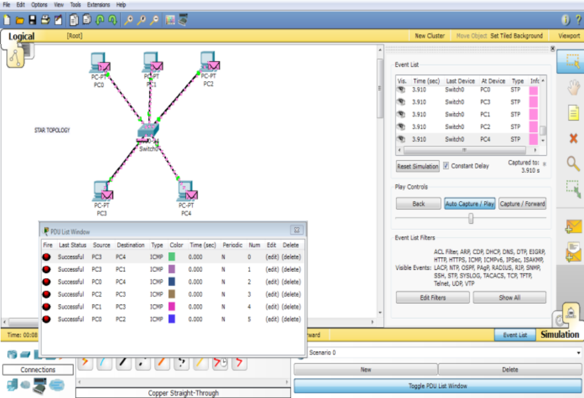
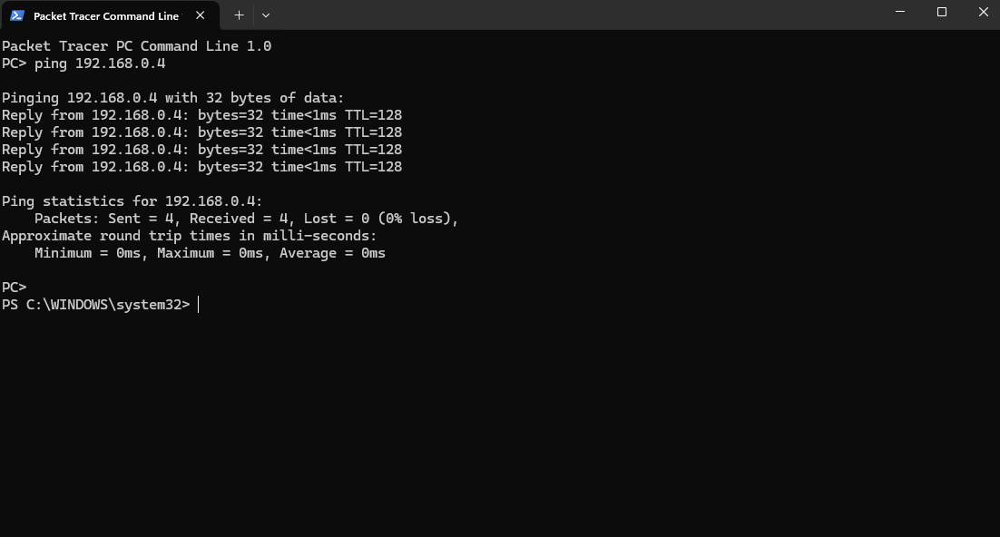

#file:markdown

# Computer Networks Lab (CNL) Experiments

---

## Experiment Number: 01
**Title:** Setup a wired LAN

**Problem Statement:**
Setup a wired LAN using Layer 2 Switch. It includes preparation of cable, testing of cable using line tester, configuration of machine using IP addresses, and testing using PING utility.

**Objectives:**
1. To understand the structure and working of various networks including the interconnecting devices used in them.
2. To get hands-on experience of making and testing cables.

**Requirements:**
- Layer-2 Switch
- 2 or more computers
- UTP (Cat5e/Cat6) cable
- RJ-45 connectors
- Crimping tool
- LAN cable tester
- Power supply

**Theory:**

**1) What is a LAN?**
A Local Area Network (LAN) is a group of computers and network devices connected together, usually within the same building or campus. It allows devices to share resources like files, printers, and internet access. The most common technology used in LANs is Ethernet.

**2) What is a Switch?**
A switch is a networking device that connects devices together on a computer network by using packet switching to receive, process, and forward data to the destination device. Unlike a hub, a Layer-2 switch forwards data only to the specific device that needs to receive it, making the network much more efficient.

**3) What are the types of Cables?**
- **Twisted Pair Cable:** Consists of two independently insulated wires twisted around one another. It comes in two variants: Unshielded Twisted Pair (UTP) and Shielded Twisted Pair (STP). Widely used in Ethernet networks.
- **Coaxial Cable:** Contains a central conductor, an insulating layer, a metallic shield, and an outer layer. Typically used in cable television delivery and older computer networks.
- **Fiber Optic Cable:** Uses glass or plastic threads (fibers) to transmit data as pulses of light. It offers very high bandwidth and transmits data over long distances without signal degradation.

**4) Difference between IP Address and MAC Address:**

| Feature | IP Address (Internet Protocol) | MAC Address (Media Access Control) |
| :--- | :--- | :--- |
| **Layer** | Network Layer (Layer 3) | Data Link Layer (Layer 2) |
| **Address Type** | Logical Address (can change based on network) | Physical Address (hardcoded into NIC) |
| **Length** | 32-bit (IPv4) or 128-bit (IPv6) | 48-bit (6 bytes) |
| **Example** | `192.168.1.5` | `00:1A:2B:3C:4D:5E` |
| **Provided by** | Network Administrator / DHCP | Hardware Manufacturer |

**5) Procedure:**

**a) Preparation of Ethernet Cable:**
1. Strip about 1.5 inches of the outer jacket of the UTP cable.
2. Untwist the pairs and align the wires according to the **T568B** standard (Orange-White, Orange, Green-White, Blue, Blue-White, Green, Brown-White, Brown).
3. Trim the wire ends straight across.
4. Insert the wires cleanly into the RJ-45 connector and use the crimping tool to crimp the connector tightly.

**b) Testing the Cable Using Line Tester:**
1. Plug both ends of the crimped cable into the LAN cable tester.
2. Turn on the tester. Ensure all 8 lights on both ends flash sequentially matching pin-to-pin, indicating successful connectivity.

**c) Physical Network Setup:**
1. Connect one end of the tested Ethernet cable to PC 1 and the other end to a port on the Layer-2 switch.
2. Connect PC 2 to the switch following the same process.
3. Power on the switch and the computers.

**d) IP Address Configuration:**
1. Go to `Control Panel > Network and Internet > Network Connections`.
2. Right-click on `Ethernet` and select `Properties`.
3. Select `Internet Protocol Version 4 (TCP/IPv4)` and assign static IP addresses (e.g., PC 1: `192.168.1.10`, PC 2: `192.168.1.11`) with Subnet Mask `255.255.255.0`.

**e) Testing Using PING Utility:**
1. On PC 1, open the Command Prompt (`cmd`).
2. Type `ping 192.168.1.11` and press Enter.
3. If the network is successfully set up, the terminal will display successful reply packets, indicating 0% packet loss.

**Conclusion:**
Thus, we have successfully understood the structure and working of various networks including hands-on experience of making cables, setting them up, and verifying physical connections using diagnostic tools like PING.

---

## Experiment Number: 02
**Title:** Write a Program for Error Detection and Correction for 7/8 bits ASCII codes using Hamming Code or CRC.

**Objectives:** 
To implement error detection and correction techniques.

**Outcomes:** Students will be able to,
1. Understand the concept of Error detection and correction techniques.
2. Implement error detection and correction using Hamming Code.
3. Implement error detection using CRC.

**Theory:**

**1) How does Hamming Code detect and correct errors?**
Hamming Code is an error-correcting code used in digital transmission. It inserts redundant parity bits at positions that are powers of 2 (i.e., positions 1, 2, 4, 8...). 
*Example:* 
If sending data `1011` (4 bits), parity bits `p1, p2, p4` are added to form a 7-bit codeword. By checking the parity equations on the receiver's end, we calculate an error syndrome. If the syndrome is `000`, there's no error. If the syndrome is e.g., `110` (which is 6 in decimal), it means an error occurred at bit position 6, and the receiver flips that specific bit to correct it.

**2) What is CRC? Explain with an example.**
Cyclic Redundancy Check (CRC) is an error-detecting code based on polynomial division. The sender appends a specific sequence of redundant bits (CRC remainder) to the end of the data so that the resulting data becomes exactly divisible by a predetermined polynomial (Generator).
*Example:*
Data: `100100`, Generator: `1101`. We append 3 zeros to data -> `100100000`. Dividing this by `1101` using Modulo-2 arithmetic yields a remainder (e.g., `001`). The transmitted data becomes `100100001`. The receiver divides this by `1101`. If the remainder is `000`, the data is error-free; otherwise, it is corrupted.

**Code and Output:**

**Hamming Code (Error Detection and Correction) implementation in C++:**
```cpp
#include <iostream>
using namespace std;

int main() {
    int data[10];
    int dataatrec[10], c, c1, c2, c3, i;

    cout << "Enter 4 bits of data one by one:\n";
    cin >> data[0] >> data[1] >> data[2] >> data[4];

    // Calculate Even Parity bits
    data[6] = data[0] ^ data[2] ^ data[4];
    data[5] = data[0] ^ data[1] ^ data[4];
    data[3] = data[0] ^ data[1] ^ data[2];

    cout << "Encoded data is: ";
    for(i = 0; i < 7; i++) cout << data[i];
    
    // Simulating received data
    cout << "\n\nEnter received data bits one by one (Introduce an error if you want):\n";
    for(i = 0; i < 7; i++) cin >> dataatrec[i];

    // Error detection
    c1 = dataatrec[6] ^ dataatrec[4] ^ dataatrec[2] ^ dataatrec[0];
    c2 = dataatrec[5] ^ dataatrec[4] ^ dataatrec[1] ^ dataatrec[0];
    c3 = dataatrec[3] ^ dataatrec[2] ^ dataatrec[1] ^ dataatrec[0];
    c = c3 * 4 + c2 * 2 + c1;

    if(c == 0) {
        cout << "\nNo error while transmission of data\n";
    } else {
        cout << "\nError detected at position: " << c;
        
        cout << "\nCorrecting...\nCorrect message is: ";
        // Correcting the flipped bit
        dataatrec[7-c] = (dataatrec[7-c] == 0) ? 1 : 0;
            
        for(i = 0; i < 7; i++) cout << dataatrec[i];
    }
    cout << "\n";
    return 0;
}
```

**Output:**
```
Enter 4 bits of data one by one:
1 0 1 1
Encoded data is: 1010101

Enter received data bits one by one (Introduce an error if you want):
1 0 1 0 1 1 1

Error detected at position: 2
Correcting...
Correct message is: 1010101
```

**CRC Implementation in C++:**
```cpp
#include <iostream>
#include <string>
using namespace std;

string xor1(string a, string b) {
    string result = "";
    int n = b.length();
    for(int i = 1; i < n; i++) {
        result += (a[i] == b[i]) ? "0" : "1";
    }
    return result;
}

string mod2div(string divident, string divisor) {
    int pick = divisor.length();
    string tmp = divident.substr(0, pick);
    int n = divident.length();
    while (pick < n) {
        if (tmp[0] == '1') tmp = xor1(divisor, tmp) + divident[pick];
        else tmp = xor1(string(pick, '0'), tmp) + divident[pick];
        pick += 1;
    }
    if (tmp[0] == '1') tmp = xor1(divisor, tmp);
    else tmp = xor1(string(pick, '0'), tmp);
    return tmp;
}

int main() {
    string data = "100100";
    string key = "1101";
    
    cout << "Original Data: " << data << "\nGenerator Key: " << key << "\n";
    
    string appended_data = (data + string(key.length() - 1, '0'));
    string remainder = mod2div(appended_data, key);
    string codeword = data + remainder;
    
    cout << "Remainder (CRC): " << remainder << "\n";
    cout << "Encoded Transmission Data: " << codeword << "\n";
    return 0;
}
```

**Output:**
```
Original Data: 100100
Generator Key: 1101
Remainder (CRC): 001
Encoded Transmission Data: 100100001
```

**Conclusion:**
We have successfully implemented both Hamming Code (for error detection and correction) and the Cyclic Redundancy Check (for error detection).

---

## Experiment Number: 03
**Title:** Write a Program to simulate Go Back N and Selective Repeat Modes of Sliding Window Protocol in Peer-to-Peer mode.

**Objectives:** 
To simulate Go Back N and Selective Repeat Modes of Sliding Window Protocol.

**Outcomes:** Students will be able to,
1. Understand the concept of Sliding Window Protocol.
2. Implement Go Back N protocol and Selective Repeat Protocol.

**Theory:**

**1) Go Back N Protocol:**
In Go-Back-N (GBN), the sender can send multiple frames before receiving an acknowledgment, but is constrained to have no more than `N` unacknowledged frames in the pipeline at any given time. If the sender receives a NAK or if a timer expires for a particular frame, it must resend that frame and **all** subsequent frames in the window, discarding any newer frames received correctly by the receiver after the lost frame.

**2) Selective Repeat Protocol:**
In Selective Repeat (SR), the sender also sends multiple frames before receiving an acknowledgment. However, if a frame is lost or damaged, the receiver buffers the subsequent frames while sending a Negative Acknowledgement (NAK) for the lost frame. The sender only retransmits the exactly lost frame, increasing efficiency over GBN, though it requires sorting and buffering logic on the receiver side.

**Code and Output:**

**Simulation of Go-Back-N in C++:**
```cpp
#include <iostream>
#include <vector>
#include <ctime>
#include <cstdlib>

using namespace std;

void goBackN(int totalFrames, int windowSize) {
    int framesSent = 0;
    int ackReceived = 0;
    
    while (ackReceived < totalFrames) {
        cout << "\n--- Window Sliding ---" << endl;
        // Sending frames in window window
        for(int i = ackReceived; i < ackReceived + windowSize && i < totalFrames; i++) {
            cout << "Sending Frame [" << i << "]" << endl;
        }

        // Simulate acknowledgment or failure
        int success = rand() % 3; // 1/3 chance to fail for simulation
        
        if (success != 0) { 
            cout << "Acknowledgment received for Frame [" << ackReceived << "]" << endl;
            ackReceived++;
        } else {
            cout << "ERROR/TIMEOUT! Frame [" << ackReceived << "] was lost." << endl;
            cout << "Go-Back-N Triggered. Retransmitting entire window starting from Frame [" << ackReceived << "]" << endl;
        }
    }
}

int main() {
    srand(time(0));
    cout << "Sliding Window Protocol: GO-BACK-N" << endl;
    goBackN(5, 3); // 5 total frames, window size 3
    return 0;
}
```

**Output:**
```
Sliding Window Protocol: GO-BACK-N

--- Window Sliding ---
Sending Frame [0]
Sending Frame [1]
Sending Frame [2]
Acknowledgment received for Frame [0]

--- Window Sliding ---
Sending Frame [1]
Sending Frame [2]
Sending Frame [3]
Acknowledgment received for Frame [1]

--- Window Sliding ---
Sending Frame [2]
Sending Frame [3]
Sending Frame [4]
ERROR/TIMEOUT! Frame [2] was lost.
Go-Back-N Triggered. Retransmitting entire window starting from Frame [2]

--- Window Sliding ---
Sending Frame [2]
Sending Frame [3]
Sending Frame [4]
Acknowledgment received for Frame [2]
...
```

**Simulation of Selective Repeat in C++:**
```cpp
#include <iostream>
#include <vector>
#include <ctime>
#include <cstdlib>

using namespace std;

void selectiveRepeat(int totalFrames, int windowSize) {
    vector<bool> acked(totalFrames, false);
    int ackReceived = 0;
    
    while(ackReceived < totalFrames) {
        cout << "\n--- Transmission Round ---" << endl;
        int limit = min(ackReceived + windowSize, totalFrames);
        
        for(int i = ackReceived; i < limit; i++) {
            if(!acked[i]) {
                cout << "Sending Frame [" << i << "]" << endl;
            }
        }
        
        for(int i = ackReceived; i < limit; i++) {
            if(!acked[i]) {
                int success = rand() % 3; // Simulation
                if (success != 0) {
                    cout << "Acknowledgment received for Frame [" << i << "]" << endl;
                    acked[i] = true;
                } else {
                    cout << "NAK! Frame [" << i << "] failed. Will selective repeat." << endl;
                }
            }
        }
        
        // Advance window
        while(ackReceived < totalFrames && acked[ackReceived]) {
            ackReceived++;
        }
    }
}

int main() {
    srand(time(0));
    cout << "Sliding Window Protocol: SELECTIVE REPEAT" << endl;
    selectiveRepeat(4, 2);
    return 0;
}
```

**Output:**
```
Sliding Window Protocol: SELECTIVE REPEAT

--- Transmission Round ---
Sending Frame [0]
Sending Frame [1]
NAK! Frame [0] failed. Will selective repeat.
Acknowledgment received for Frame [1]

--- Transmission Round ---
Sending Frame [0]
Acknowledgment received for Frame [0]
```

**Conclusion:**
We have successfully implemented and simulated the Sliding Window Protocols (Go back N protocol and Selective Repeat Protocol).

---

## Experiment No: 04
**Title:** Implementation of different types of topologies and types of transmission media by using a packet tracer tool.

**Objectives:** 
1. To learn different types of topologies and transmission media.
2. To learn the packet tracer tool.

**Problem Statement:** 
Demonstrate the different types of topologies and types of transmission media by using a packet tracer tool.

**Outcomes:** Students will be able to,
1. Get familiar with the packet tracer tool.
2. Implement different topologies using the packet tracer tool.
3. Understand different transmission media.

**Theory:**

**1) Explain Cisco Packet Tracer Tool:**
Cisco Packet Tracer is an innovative and powerful networking simulation program that allows students to experiment with network behavior and ask "what if" questions. It provides networking simulation and visualization features that make complex networking concepts easier to understand. Students can build virtual networks using routers, switches, end devices, and cables.

**2) What are the Different types of Topology?**
Network topology refers to the geometric arrangement of devices and cables in a local area network (LAN).
- **Bus Topology:** Every workstation is connected to a single central cable.
- **Star Topology:** All nodes are connected to a central connection point, such as a hub or a switch.
- **Ring Topology:** Devices are connected in a closed-loop circle structure.
- **Mesh Topology:** Every node is connected to every other node in the network.
- **Tree/Hierarchical Topology:** Connects multiple star topology networks using a central bus.

**3) Steps to Configure and Setup a Network Topology in Cisco Packet Tracer:**

**Implementing Star Topology:**

**Step 1:** Open the Cisco Packet Tracer desktop and select the required devices from the bottom tray.
- Take 1 `Switch (PT-Switch)`.
- Take 4 `PCs (End Devices)`.

**IP Addressing Table for Configuration:**
| S.NO | Device | IPv4 Address | Subnet Mask |
| :--- | :--- | :--- | :--- |
| 1 | `pc0` | `192.168.0.1` | `255.255.255.0` |
| 2 | `pc1` | `192.168.0.2` | `255.255.255.0` |
| 3 | `pc2` | `192.168.0.3` | `255.255.255.0` |
| 4 | `pc3` | `192.168.0.4` | `255.255.255.0` |

**Step 2:** Use the `Automatically Choose Connection Type` cable to connect every PC device directly to the central Switch, forming a Star arrangement.



**Step 3:** Configure the PCs with their respective IPv4 Addresses.
- Click on `PC0` -> Go to `Desktop` tab -> Click `IP Configuration`.
- Enter IPv4 Address `192.168.0.1` and Subnet Mask `255.255.255.0`.
- Repeat this routing for `PC1`, `PC2`, and `PC3` using the respective addresses from the table above. 
*(Alternatively, you can open the Command Prompt terminal of the PC within Packet Tracer and type: `ipconfig 192.168.0.1 255.255.255.0`)*

**Step 4:** Verify the configuration and test data transmission across the network using the ping command.
- Click on `PC0` and open its `Command Prompt`.
- Execute the command: `ping 192.168.0.4` (Targeting PC3).
- If the implementation is successful, you will receive four data packet reply acknowledgments from the targeted host node without any packet loss. 



**Conclusion:** 
We have successfully learned how to implement different topologies using different transmission media in the Cisco packet tracer simulation tool.

---

## Experiment Number: 05
**Title:** Write a program to implement Link State / Distance Vector routing protocol to find a suitable path for transmission.

**Problem Statement:**
Find suitable path for transmission using Link State and Distance Vector routing protocol concepts.

**Objectives:**
1. To understand the basic concept of routing protocols.
2. To implement Distance Vector routing protocol.
3. To implement Link State routing protocol.

**Outcomes:** Students will be able to,
1. Understand routing protocol behavior.
2. Implement Distance Vector routing protocol.
3. Implement Link State routing protocol.

**Theory:**

**1) Distance Vector Routing Protocol:**
In Distance Vector routing, each router maintains a table of minimum cost (distance) to every destination and shares it with neighbors periodically. Routers update their table using Bellman-Ford style updates.

**2) Link State Routing Protocol:**
In Link State routing, every router creates a map of the full network topology and computes shortest paths using Dijkstra's algorithm. OSPF is a practical example of a link-state protocol.

**Code and Output:**

**Distance Vector Routing (C++):**
```cpp
#include <iostream>
#include <vector>
#include <iomanip>
using namespace std;

const int INF = 100000000;

int main() {
    // Adjacency matrix: cost between routers
    vector<vector<int>> cost = {
        {0, 2, 5, INF},
        {2, 0, 1, 4},
        {5, 1, 0, 3},
        {INF, 4, 3, 0}
    };

    int n = static_cast<int>(cost.size());
    vector<vector<int>> dist = cost;

    // Bellman-Ford style relaxation for all pairs
    for (int k = 0; k < n - 1; k++) {
        for (int i = 0; i < n; i++) {
            for (int j = 0; j < n; j++) {
                for (int v = 0; v < n; v++) {
                    if (dist[i][v] < INF && dist[v][j] < INF) {
                        dist[i][j] = min(dist[i][j], dist[i][v] + dist[v][j]);
                    }
                }
            }
        }
    }

    cout << "Distance Vector Routing Table (Minimum Cost):\n";
    cout << "    ";
    for (int j = 0; j < n; j++) cout << "R" << j << "  ";
    cout << "\n";

    for (int i = 0; i < n; i++) {
        cout << "R" << i << "  ";
        for (int j = 0; j < n; j++) {
            if (dist[i][j] >= INF) cout << setw(3) << "-";
            else cout << setw(3) << dist[i][j];
            cout << " ";
        }
        cout << "\n";
    }

    return 0;
}
```

**Output:**
```text
Distance Vector Routing Table (Minimum Cost):
    R0  R1  R2  R3
R0    0   2   3   6
R1    2   0   1   4
R2    3   1   0   3
R3    6   4   3   0
```

**Link State Routing (C++ using Dijkstra):**
```cpp
#include <iostream>
#include <vector>
#include <queue>
#include <utility>
using namespace std;

const int INF = 100000000;

int main() {
    // Graph as adjacency matrix (same topology)
    vector<vector<int>> graph = {
        {0, 2, 5, 0},
        {2, 0, 1, 4},
        {5, 1, 0, 3},
        {0, 4, 3, 0}
    };

    int n = static_cast<int>(graph.size());
    int source = 0;
    vector<int> dist(n, INF);
    vector<int> parent(n, -1);

    priority_queue<pair<int, int>, vector<pair<int, int>>, greater<pair<int, int>>> pq;
    dist[source] = 0;
    pq.push({0, source});

    while (!pq.empty()) {
        auto top = pq.top();
        pq.pop();
        int d = top.first;
        int u = top.second;

        if (d != dist[u]) continue;

        for (int v = 0; v < n; v++) {
            if (graph[u][v] > 0 && dist[u] + graph[u][v] < dist[v]) {
                dist[v] = dist[u] + graph[u][v];
                parent[v] = u;
                pq.push({dist[v], v});
            }
        }
    }

    cout << "Link State Routing (Dijkstra) from R" << source << ":\n";
    for (int i = 0; i < n; i++) {
        cout << "Destination R" << i << " -> Cost: " << dist[i] << "\n";
    }

    return 0;
}
```

**Output:**
```text
Link State Routing (Dijkstra) from R0:
Destination R0 -> Cost: 0
Destination R1 -> Cost: 2
Destination R2 -> Cost: 3
Destination R3 -> Cost: 6
```

**Conclusion:**
Thus, we have successfully implemented and understood Distance Vector and Link State routing protocol algorithms for shortest-path transmission.

---

## Experiment Number: 06
**Title:** Use Packet Tracer tool for configuration of 3 router network using one of the following protocols: RIP / OSPF / BGP.

**Problem Statement:**
Configure and verify a 3-router network using routing protocol configuration in Cisco Packet Tracer.

**Objectives:**
1. To understand routing protocols RIP, OSPF, and BGP.
2. To configure routers and verify end-to-end connectivity.

**Outcomes:** Students will be able to,
1. Understand practical router configuration workflow.
2. Configure multi-router network using RIP/OSPF/BGP in Packet Tracer.

**Theory:**

**1) RIP (Routing Information Protocol):**
Distance-vector protocol using hop-count metric. Maximum hop count is 15.

**2) OSPF (Open Shortest Path First):**
Link-state protocol using SPF algorithm and cost metric.

**3) BGP (Border Gateway Protocol):**
Path-vector protocol used between autonomous systems in large networks.

**Procedure (RIP Example with 3 Routers):**
1. Place 3 routers, 3 switches, and 6 PCs in Packet Tracer.
2. Configure IP addresses on PCs and router interfaces.
3. Enable RIP and advertise connected networks.
4. Verify connectivity using `ping`, `show ip route`, and `show ip protocols`.

**RIP Configuration Commands:**
```text
Router0(config)# router rip
Router0(config-router)# network 192.168.10.0
Router0(config-router)# network 10.0.0.0

Router1(config)# router rip
Router1(config-router)# network 192.168.20.0
Router1(config-router)# network 10.0.0.0
Router1(config-router)# network 11.0.0.0

Router2(config)# router rip
Router2(config-router)# network 192.168.30.0
Router2(config-router)# network 11.0.0.0
```

**Verification Commands:**
```text
PC0> ping 192.168.30.2
Router0# show ip route
Router0# show ip protocols
```

**Output (Sample):**
```text
PC0> ping 192.168.30.2
Reply from 192.168.30.2: bytes=32 time<1ms TTL=127
Reply from 192.168.30.2: bytes=32 time<1ms TTL=127
Reply from 192.168.30.2: bytes=32 time<1ms TTL=127
Reply from 192.168.30.2: bytes=32 time<1ms TTL=127

Success rate is 100 percent (4/4)
```

**Conclusion:**
Thus, we have successfully configured and verified a 3-router network in Cisco Packet Tracer using routing protocol commands.

---

## Experiment Number: 07
**Title:** Write a program using TCP socket for wired network for the following: (a) Say hello to each other, (b) File transfer, (c) Calculator, OR write a program using UDP sockets to enable file transfer between two machines.

**Objectives:**
1. Set up TCP connection between two nodes.
2. Implement hello message exchange, file transfer, and calculator operation using TCP.
3. Set up UDP transfer between two nodes for different file types.

**Outcomes:** Students will be able to,
1. Understand TCP and UDP socket programming.
2. Implement client-server communication in TCP.
3. Implement file transfer using UDP datagrams.

**Theory:**

**1) What is a Socket?**
A socket is an endpoint of communication between two processes over a network.

**2) Berkeley Socket Primitives:**
Key primitives include `socket()`, `bind()`, `listen()`, `accept()`, `connect()`, `send()/recv()`, and `close()`.

**3) TCP Socket Programming:**
Connection-oriented, reliable byte stream with acknowledgment and retransmission.

**4) UDP Socket Programming:**
Connectionless communication using datagrams with lower overhead.

**Code and Output:**

**A) TCP Server (`server.cpp`)**
```cpp
#include <iostream>
#include <unistd.h>
#include <string.h>
#include <arpa/inet.h>
#include <fstream>
using namespace std;

int main() {
    int server_fd, new_socket;
    sockaddr_in address{};
    socklen_t addrlen = sizeof(address);
    char buffer[1024] = {0};

    server_fd = socket(AF_INET, SOCK_STREAM, 0);
    address.sin_family = AF_INET;
    address.sin_addr.s_addr = INADDR_ANY;
    address.sin_port = htons(5000);

    bind(server_fd, (sockaddr *)&address, sizeof(address));
    listen(server_fd, 3);

    cout << "Server waiting for connection...\n";
    new_socket = accept(server_fd, (sockaddr *)&address, &addrlen);
    cout << "Client connected!\n";

    while (true) {
        memset(buffer, 0, sizeof(buffer));
        int r = read(new_socket, buffer, sizeof(buffer));
        if (r <= 0) break;

        string data(buffer);

        if (data == "HELLO") {
            send(new_socket, "Hello from Server!", 18, 0);
        } else if (data.rfind("FILE", 0) == 0) {
            ofstream file("received_file.txt", ios::binary);
            while (true) {
                memset(buffer, 0, sizeof(buffer));
                int bytes = read(new_socket, buffer, sizeof(buffer));
                if (bytes <= 0 || strncmp(buffer, "EOF", 3) == 0) break;
                file.write(buffer, bytes);
            }
            file.close();
            send(new_socket, "File received successfully", 26, 0);
        } else if (data.rfind("CALC", 0) == 0) {
            string expr = data.substr(5);
            int a, b;
            char op;
            sscanf(expr.c_str(), "%d%c%d", &a, &op, &b);

            int result = 0;
            switch (op) {
                case '+': result = a + b; break;
                case '-': result = a - b; break;
                case '*': result = a * b; break;
                case '/': result = (b != 0) ? a / b : 0; break;
                default: result = 0;
            }

            string out = to_string(result);
            send(new_socket, out.c_str(), out.length(), 0);
        } else if (data == "EXIT") {
            break;
        }
    }

    close(new_socket);
    close(server_fd);
    return 0;
}
```

**A) TCP Client (`client.cpp`)**
```cpp
#include <iostream>
#include <unistd.h>
#include <arpa/inet.h>
#include <string.h>
#include <fstream>
using namespace std;

int main() {
    int sock = socket(AF_INET, SOCK_STREAM, 0);
    sockaddr_in serv_addr{};
    char buffer[1024] = {0};

    serv_addr.sin_family = AF_INET;
    serv_addr.sin_port = htons(5000);
    inet_pton(AF_INET, "127.0.0.1", &serv_addr.sin_addr);
    connect(sock, (sockaddr *)&serv_addr, sizeof(serv_addr));

    while (true) {
        int choice;
        cout << "\n1. Say Hello\n2. Send File\n3. Calculator\n4. Exit\n";
        cout << "Enter choice: ";
        cin >> choice;
        cin.ignore();

        memset(buffer, 0, sizeof(buffer));

        if (choice == 1) {
            send(sock, "HELLO", 5, 0);
            read(sock, buffer, sizeof(buffer));
            cout << "Server: " << buffer << "\n";
        } else if (choice == 2) {
            ifstream file("send.txt", ios::binary);
            if (!file) {
                cout << "File not found\n";
                continue;
            }
            send(sock, "FILE", 4, 0);
            while (!file.eof()) {
                file.read(buffer, sizeof(buffer));
                send(sock, buffer, file.gcount(), 0);
            }
            send(sock, "EOF", 3, 0);
            memset(buffer, 0, sizeof(buffer));
            read(sock, buffer, sizeof(buffer));
            cout << buffer << "\n";
            file.close();
        } else if (choice == 3) {
            string expr;
            cout << "Enter expression (e.g., 10+5): ";
            cin >> expr;
            string msg = "CALC " + expr;
            send(sock, msg.c_str(), msg.length(), 0);
            read(sock, buffer, sizeof(buffer));
            cout << "Result: " << buffer << "\n";
        } else if (choice == 4) {
            send(sock, "EXIT", 4, 0);
            break;
        }
    }

    close(sock);
    return 0;
}
```

**B) UDP Server (`udp_server.cpp`)**
```cpp
#include <iostream>
#include <arpa/inet.h>
#include <unistd.h>
#include <fstream>
#include <cstring>
using namespace std;

#define PORT 5001
#define BUFFER_SIZE 1024

int main() {
    int sockfd = socket(AF_INET, SOCK_DGRAM, 0);
    char buffer[BUFFER_SIZE];
    sockaddr_in server_addr{}, client_addr{};
    socklen_t addr_len = sizeof(client_addr);

    server_addr.sin_family = AF_INET;
    server_addr.sin_port = htons(PORT);
    server_addr.sin_addr.s_addr = INADDR_ANY;
    bind(sockfd, (sockaddr *)&server_addr, sizeof(server_addr));

    cout << "UDP Server is running and waiting...\n";

    for (int i = 0; i < 4; i++) {
        memset(buffer, 0, BUFFER_SIZE);
        recvfrom(sockfd, buffer, BUFFER_SIZE, 0, (sockaddr *)&client_addr, &addr_len);

        string filename = "received_" + string(buffer);
        ofstream file(filename, ios::binary);
        cout << "Receiving file: " << filename << "\n";

        while (true) {
            memset(buffer, 0, BUFFER_SIZE);
            int bytes = recvfrom(sockfd, buffer, BUFFER_SIZE, 0, (sockaddr *)&client_addr, &addr_len);
            if (bytes <= 0 || strncmp(buffer, "EOF", 3) == 0) break;
            file.write(buffer, bytes);
        }

        file.close();
        cout << "File received successfully: " << filename << "\n";
    }

    cout << "All 4 files received successfully.\n";
    close(sockfd);
    return 0;
}
```

**B) UDP Client (`udp_client.cpp`)**
```cpp
#include <iostream>
#include <arpa/inet.h>
#include <unistd.h>
#include <fstream>
#include <cstring>
using namespace std;

#define PORT 5001
#define BUFFER_SIZE 1024

int main() {
    int sockfd = socket(AF_INET, SOCK_DGRAM, 0);
    char buffer[BUFFER_SIZE];
    sockaddr_in server_addr{};

    server_addr.sin_family = AF_INET;
    server_addr.sin_port = htons(PORT);
    inet_pton(AF_INET, "127.0.0.1", &server_addr.sin_addr);

    string files[4];
    cout << "Enter Script file name: "; cin >> files[0];
    cout << "Enter Text file name: "; cin >> files[1];
    cout << "Enter Audio file name: "; cin >> files[2];
    cout << "Enter Video file name: "; cin >> files[3];

    for (int i = 0; i < 4; i++) {
        ifstream file(files[i], ios::binary);
        if (!file) {
            cout << "File not found: " << files[i] << "\n";
            continue;
        }

        sendto(sockfd, files[i].c_str(), files[i].length(), 0, (sockaddr *)&server_addr, sizeof(server_addr));
        cout << "Sending file: " << files[i] << "\n";

        while (!file.eof()) {
            file.read(buffer, BUFFER_SIZE);
            sendto(sockfd, buffer, file.gcount(), 0, (sockaddr *)&server_addr, sizeof(server_addr));
        }

        sendto(sockfd, "EOF", 3, 0, (sockaddr *)&server_addr, sizeof(server_addr));
        file.close();
        cout << "File sent successfully: " << files[i] << "\n";
    }

    cout << "All 4 files sent successfully.\n";
    close(sockfd);
    return 0;
}
```

**Compilation and Execution (Linux/Unix):**
```bash
g++ server.cpp -o server
g++ client.cpp -o client
./server
./client

g++ udp_server.cpp -o udp_server
g++ udp_client.cpp -o udp_client
./udp_server
./udp_client
```

**Output (Sample):**
```text
Server waiting for connection...
Client connected!

Client Menu:
1. Say Hello
2. Send File
3. Calculator
4. Exit

Enter choice: 1
Server: Hello from Server!

Enter choice: 3
Enter expression (e.g., 10+5): 10+5
Result: 15

Enter choice: 2
File received successfully

UDP Server is running and waiting...
Receiving file: received_script.cpp
File received successfully: received_script.cpp
...
All 4 files received successfully.
```

**Conclusion:**
Thus, we have successfully implemented socket programming using both TCP and UDP for communication and file transfer.

---

## Experiment Number: 08
**Title:** Write a program for DNS lookup. Given an IP address as input, it should return URL and vice-versa.

**Problem Statement:**
Map hostname to IP address (forward lookup) and IP address to hostname (reverse lookup) using DNS.

**Objectives:**
1. To get hostname and IP address information.
2. To map hostname with IP address and vice-versa.

**Outcomes:** Students will be able to,
1. Understand the need of DNS.
2. Implement a DNS lookup utility program.

**Theory:**

**1) What is DNS?**
DNS (Domain Name System) translates human-readable domain names into IP addresses and also supports reverse lookup through PTR records.

**2) How TCP/IP uses DNS:**
A DNS client sends query to DNS server to resolve name-to-address mapping before establishing network communication.

**Code and Output:**

**DNS Lookup Program (C++ / POSIX):**
```cpp
#include <iostream>
#include <arpa/inet.h>
#include <netdb.h>
#include <cstring>
using namespace std;

void forwardLookup(const string &host) {
    hostent *he = gethostbyname(host.c_str());
    if (he == nullptr) {
        herror("gethostbyname");
        return;
    }

    in_addr **addr_list = (in_addr **)he->h_addr_list;
    cout << "IP address(es) of " << host << ":\n";
    for (int i = 0; addr_list[i] != nullptr; i++) {
        cout << inet_ntoa(*addr_list[i]) << "\n";
    }
}

void reverseLookup(const string &ip) {
    sockaddr_in sa{};
    sa.sin_family = AF_INET;

    if (inet_pton(AF_INET, ip.c_str(), &sa.sin_addr) <= 0) {
        cout << "Invalid IP address format\n";
        return;
    }

    hostent *he = gethostbyaddr(&sa.sin_addr, sizeof(sa.sin_addr), AF_INET);
    if (he == nullptr) {
        herror("gethostbyaddr");
        return;
    }

    cout << "Domain name of " << ip << ": " << he->h_name << "\n";
}

int main() {
    int choice;
    string input;

    cout << "DNS Lookup Program\n";
    cout << "1. Forward Lookup (Domain -> IP)\n";
    cout << "2. Reverse Lookup (IP -> Domain)\n";
    cout << "Enter your choice: ";
    cin >> choice;

    if (choice == 1) {
        cout << "Enter domain name: ";
        cin >> input;
        forwardLookup(input);
    } else if (choice == 2) {
        cout << "Enter IP address: ";
        cin >> input;
        reverseLookup(input);
    } else {
        cout << "Invalid choice!\n";
    }

    return 0;
}
```

**Compilation and Execution (Linux/Unix):**
```bash
g++ dns_lookup.cpp -o dns_lookup
./dns_lookup
```

**Output (Sample):**
```text
DNS Lookup Program
1. Forward Lookup (Domain -> IP)
2. Reverse Lookup (IP -> Domain)
Enter your choice: 1
Enter domain name: www.google.com
IP address(es) of www.google.com:
142.250.192.196

DNS Lookup Program
1. Forward Lookup (Domain -> IP)
2. Reverse Lookup (IP -> Domain)
Enter your choice: 2
Enter IP address: 142.250.192.196
Domain name of 142.250.192.196: del03s06-in-f4.1e100.net
```

**Conclusion:**
Thus, we have successfully implemented DNS forward and reverse lookup program.